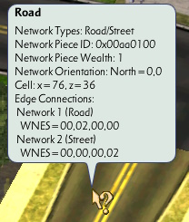

# sc4-query-ui-hooks

A DLL Plugin for SimCity 4 that extends the query UI.   

The plugin can be downloaded from the Releases tab: https://github.com/0xC0000054/sc4-query-ui-hooks/releases

## Features

### Additional Building Query Dialog Variables

The DLL provides a number of new variables that can be used in the LTEXT files
of a building query dialog in the form of `#variable_name#`.

Variable List

| Name | Description |
|------|-------------|
| building_full_funding_capacity | The cost for Education, Fire, Health, Police and Power buildings at the full (100%) capacity. For Fire and Police stations this is the coverage radius. |
| building_full_funding_coverage | The cost for Education, and Health buildings at the full (100%) coverage radius (School Bus/Ambulance). |
| building_is_w2w | Shows a 'Yes' or 'No' value based on whether the building has a W2W occupant group. |
| building_styles | Shows a building's styles in a pipe-separated list. |
| building_style_lines | Shows a list of the building's styles, with each style after the first one on its own line. E.g:`Chicago 1890` `New York 1940` |
| growth_stage | The growth stage of the building's lot. |
| mysim_name | The name of the MySim that lives in the selected residence. |
| r1_occupancy | The current number of R§ occupants. |
| r1_capacity | The R§ occupant capacity. |
| r2_occupancy | The current number of R§§ occupants. |
| r2_capacity | The R§§ occupant capacity. |
| r3_occupancy | The current number of R§§§ occupants. |
| r3_capacity | The R§§§ occupant capacity. |
| cs1_occupancy | The current number of Cs§ occupants. |
| cs1_capacity | The Cs§ occupant capacity. |
| cs2_occupancy | The current number of Cs§§ occupants. |
| cs2_capacity | The Cs§§ occupant capacity. |
| cs3_occupancy | The current number of Cs§§§ occupants. |
| cs3_capacity | The Cs§§§ occupant capacity. |
| co2_occupancy | The current number of Co§§ occupants. |
| co2_capacity | The Co§§ occupant capacity. |
| co3_occupancy | The current number of Co§§§ occupants. |
| co3_capacity | The Co§§§ occupant capacity. |
| ir_occupancy | The current number of I-R occupants. |
| ir_capacity | The I-R occupant capacity. |
| id_occupancy | The current number of I-D occupants. |
| id_capacity | The I-D occupant capacity. |
| im_occupancy | The current number of I-M occupants. |
| im_capacity | The I-M occupant capacity. |
| iht_occupancy | The current number of I-HT occupants. |
| iht_capacity | The I-HT occupant capacity. |

Multiple `*_occupancy` and `*_capacity` variables can be combined in a LTEXT query to show the filled/available occupancy.
e.g. `#cs1_occupancy#/#cs1_capacity#`.

### Advanced Network Query Tool Tip

A custom advanced/debug query tool tip is provided for the transportation networks, excluding power lines and pipes.   
This tool tip is accessed by holding `Control + Alt + Shift` when hovering over a network piece.

### Shift + Click Building Copying

Holding down the Shift key when clicking a building will activate the Place Lot tool with the building's lot selected.
Note that the exact building may be different if the lot uses Building Families.

## SC4QueryUIHooks INI File

This file contains the following options.

### EnableOccupantQuerySounds

This option controls whether the query sounds are played when clicking on an item to open the query dialog
or copy the lot, the default is _true_.
The occupant query sound properties affected by this option are SFX:Query Sound, SFX:Query Sound Abandoned and SFX:Query Sound Decayed.

### LogBuildingPluginPath

This option controls whether the building name and plugin file path will be written to the log file when the
building is queried, the default is _false_.

## Using the Code

1. Copy the headers from `src/public/include` folder into your GZCOM DLL project.
2. Implement `cIBuildingQueryDialogHookTarget`, `cIBuildingQueryToolTipHookTarget`, `cINetworkQueryToolTipHookTarget` and/or
`cIQueryToolTipAppendTextHookTarget` as additional interface(s) on your GZCOM DLL director.
3. Subscribe for the notifications in `PostCityInit` and unsubscribe in `PreCityShutdown`.

### Notes for Developers

#### cIBuildingQueryDialogHookTarget

An implementation of this callback interface receives a message before and after the building query dialog is shown.    
The intended use case for these callbacks is that the implementer can use the game's `cISCStringDetokenizer::AddUnknownTokenReplacementMethod` function
to register a function to handle occupant-specific string tokens in their `BeforeDialogShown` method, and unregister it in their `AfterDialogShown` method.

#### Tool Tip Advanced/Debug Query

The Tool Tip hook callbacks have a `debugQuery` parameter, this parameter is set to `true` if the user activated the
game's advanced/debug query mode by holding down `Control + Alt + Shift` before hovering over an item.

#### cIBuildingQueryToolTipHookTarget and cINetworkQueryToolTipHookTarget

An implementation of these callback interfaces should try to target a narrow set of activation conditions
to avoid conflicts between different callback subscribers.    
The tool tip callbacks for a specific occupant will be stopped after a subscriber reports that it handled
the tool tip, the order that the callbacks are executed in is unspecified.
If no subscriber set a custom tool tip for the specific occupant, the game's default tool tip will be shown.

#### cIQueryToolTipAppendTextHookTarget

An implementation of this callback interface allows callers to append one or more lines of text to the end of
the current tool tip. Multiple lines of text can be added by separating them with `\n`.    
The number of lines added to the query and the length of each line should be kept as small as possible. SC4
has a limited amount of space that it reserves for the query tool tip text, and it may fail to display a tool
tip that exceeds its limits.

### Sample Implementations

See [BuildingQueryVariablesDllDirector.cpp](src/child-directors/BuildingQueryVariablesDllDirector.cpp) and [NetworkQueryToolTipDllDirector.cpp](src/child-directors/NetworkQueryToolTipDllDirector.cpp).

## System Requirements

* SimCity 4 version 641
* Windows 10 or later

The plugin may work on Windows 7 or later with the [Microsoft Visual C++ 2022 x86 Redistribute](https://aka.ms/vs/17/release/vc_redist.x86.exe) installed, but I do not have the ability to test that.

## Installation

1. Close SimCity 4.
2. Copy `SC4QueryUIHooks.dll` and `SC4QueryUIHooks.ini` into the top-level of the Plugins folder in the SimCity 4 installation directory or Documents/SimCity 4 directory.
3. Start SimCity 4.

## Troubleshooting

The plugin should write a `SC4QueryUIHooks.log` file in the same folder as the plugin.    
The log contains status information for the most recent run of the plugin.

# License

This project is licensed under the terms of the MIT License.    
See [LICENSE.txt](LICENSE.txt) for more information.

## 3rd party code

[gzcom-dll](https://github.com/nsgomez/gzcom-dll/tree/master) Located in the vendor folder, MIT License.    
[EABase](https://github.com/electronicarts/EABase) Located in the vendor folder, BSD 3-Clause License.    
[EASTL](https://github.com/electronicarts/EASTL) Located in the vendor folder, BSD 3-Clause License.    
[Windows Implementation Library](https://github.com/microsoft/wil) - MIT License    
[SC4Fix](https://github.com/nsgomez/sc4fix) - MIT License    
[Boost.Algorithm](https://www.boost.org/doc/libs/1_84_0/libs/algorithm/doc/html/index.html) - Boost Software License, Version 1.0.    
[Boost.PropertyTree](https://www.boost.org/doc/libs/1_84_0/doc/html/property_tree.html) - Boost Software License, Version 1.0.    
[sc4-more-building-styles](https://github.com/0xC0000054/sc4-more-building-styles) - MIT License

# Source Code

## Prerequisites

* Visual Studio 2022

## Building the plugin

* Open the solution in the `src` folder
* Update the post build events to copy the build output to you SimCity 4 application plugins folder.
* Build the solution

## Debugging the plugin

Visual Studio can be configured to launch SimCity 4 on the Debugging page of the project properties.
I configured the debugger to launch the game in full screen with the following command line:    
`-intro:off -CPUcount:1 -w -CustomResolution:enabled -r1920x1080x32`

You may need to adjust the window resolution for your primary screen.
